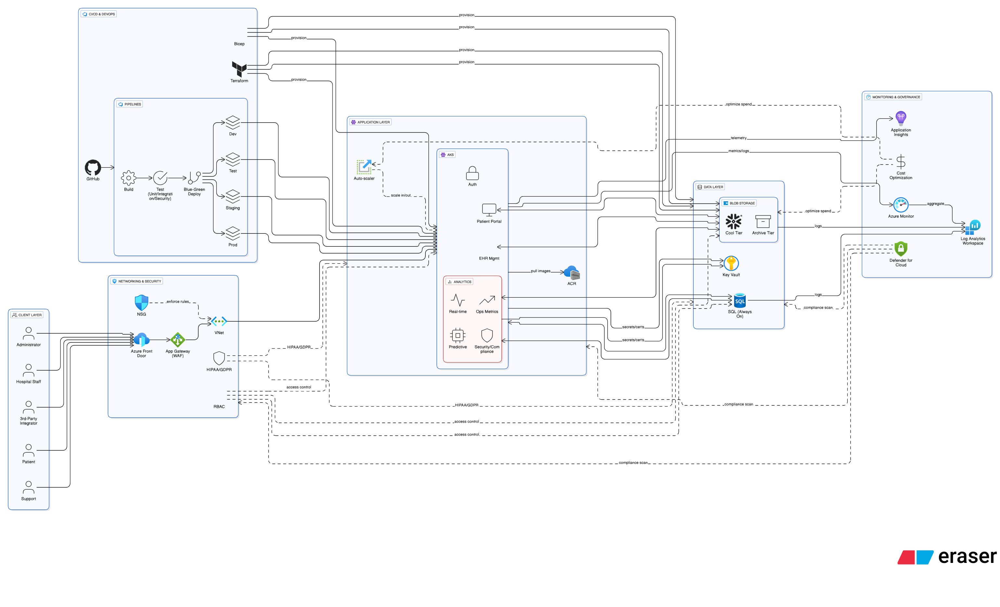

# Cloud Case Study: Transforming a Healthcare SaaS Platform with Azure & DevOps Automation
## 🏗️ Architecture Diagram

Below is the reference architecture designed by **CloudieHub** for the Healthcare SaaS platform:

## 🏢 Client Background

A **Healthcare SaaS provider** offered electronic health record (EHR) and patient engagement solutions to hospitals and clinics across the US. As customer adoption increased, their on-premise solution migrated to Azure but faced challenges with compliance, scalability, and deployment agility.

They approached **CloudieHub** to modernize their cloud infrastructure and improve DevOps maturity while ensuring HIPAA compliance.

---

## ⚠️ Challenges

1. **Scalability Issues**
   - Application was hosted on Azure VMs with manual scaling.
   - Struggled to handle traffic during peak telehealth sessions.

2. **Compliance & Security Gaps**
   - Limited auditing for HIPAA compliance.
   - No encryption at rest for sensitive patient data.
   - Weak role-based access controls (RBAC).

3. **Deployment Bottlenecks**
   - Code deployments took 3–4 hours.
   - Manual rollback processes increased downtime risk.

4. **Monitoring & Reliability**
   - No proactive alerts for outages.
   - Logs were scattered across multiple sources.

---

## ✅ CloudieHub Solution

### 🏗️ Infrastructure Modernization (Azure)
- Re-architected app into **microservices** running on **Azure Kubernetes Service (AKS)**.
- Introduced **Azure Application Gateway** with Web Application Firewall (WAF) for secure routing.
- Implemented **Azure SQL Database with Always On availability** for reliability.
- Enabled **Azure Blob Storage** for patient document storage with tiered cost optimization.

### 🔄 CI/CD with Azure DevOps
- Built **CI/CD pipelines in Azure DevOps** with:
  - Automated builds, tests, and security scans.
  - Canary deployments to minimize risk.
  - Automated rollback on failure.
- Infrastructure as Code (IaC) with **Terraform** for reproducibility.

### 🔒 Security & Compliance
- Configured **Azure Key Vault** for managing sensitive credentials.
- Enabled **Azure Policy & RBAC** for least privilege access.
- Enforced **end-to-end encryption (TLS + TDE in SQL)**.
- Integrated **Azure Security Center + Microsoft Defender for Cloud** for compliance monitoring.

### 📊 Monitoring & Cost Optimization
- Centralized monitoring with **Azure Monitor + Log Analytics**.
- Configured **Application Insights** for real-time performance tracking.
- Enabled **auto-scaling on AKS nodes** → reduced idle costs by 30%.
- Archived logs to **Azure Storage (Cool & Archive tiers)** → reduced logging cost by 45%.

---

## 📊 Results

| Metric             | Before CloudieHub        | After CloudieHub                |
| ------------------ | ------------------------ | ------------------------------- |
| Deployment Speed   | 3–4 hrs (manual)         | 20 mins (automated)             |
| Uptime             | 97.2%                    | 99.98%                          |
| Compliance Posture | Partial HIPAA compliance | Full HIPAA compliance (audited) |
| Cloud Costs        | $18,000/month            | $12,000/month (33% savings)     |
| Data Security      | High risk (unencrypted)  | Encrypted at rest + in transit  |

---

## 🏆 Business Impact
- **Faster innovation**: New features rolled out bi-weekly instead of quarterly.
- **Improved patient trust**: Full HIPAA compliance achieved.
- **Cost savings**: $6,000/month reallocated to R&D.
- **Resiliency**: System handled **5x traffic increase** during COVID-19 telehealth surge without downtime.

---

## 🔗 About CloudieHub
We design scalable, secure Cloud & DevOps platforms across **Azure, AWS, GCP, and Alibaba Cloud**.

📌 Website: [cloudiehub.com](https://cloudiehub.com)  
✉️ Email: [contact@cloudiehub.com](mailto:contact@cloudiehub.com)

---
